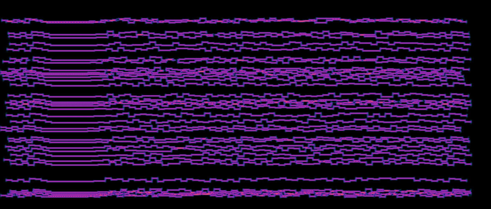

# ft8_benchmark -- A simple traffic generator for benchmarking your FT8 hardware/software




**--WIP-- Work in progress, this proto needs some love...**

## TL;DR

This project aim at generating a lot of [FT8](https://en.wikipedia.org/wiki/WSJT_(amateur_radio_software)#FT8) signals to simulate real life traffic, and allow debugging and benchmarking both software and hardware components.
This is a simple python script, you just need to install python dependencies, and sync the clock of your computer.

```bash
echo "== Python3 should be configured as default on your computer"
pip install numpy wave simpleaudio
python ft8_benchmark.py -n 20 -r 8000 -l 300 -h 2800 -p 4 -w test.wav
```

## Overview

I have to write this part...

## CAUTION -- Seriously guys!!

This application is designed to be used with dummy load **ONLY**, in your lab, not on the air! Never connect this signal generator to an antenna, you could severely impact FT8 traffic on you area. All these generated calls will never receive a confirmation reply, and if you flood the dial frequency with enough power, you could degrade FT8 communications and other users experience...

## Container Image

I have to write this part...

## Performance & hardware tests

I have to write this part...

## Features & TODO

- Audio card selector
- Prefix file to use instead of random generation
- Prefix & locator file to use instead of random generation
- Debug option to display encoded values
- Reply case for a specific callsign (instead of CQ)
- FSK / GFSK selector 
- Fading (freq & time)
- Pink noise
